# cmpe-132-project
---

## Webstack
---

- [Go](https://go.dev/doc/install)
- [Sqlite3](https://www.sqlite.org/download.html)
- [Javascript](https://www.javascript.com/)
- [JQuery](https://jquery.com/)
- [HTML](https://en.wikipedia.org/wiki/HTML)
- [BootStrap](https://getbootstrap.com/)

## How To Guide
---
1. To setup the tool, please download and setup all of the tools listed above
2. [sql/test.sql](./sql/test.sql) The way this tool works is through having admins add others to the database using the GUI, however the admin would have to be manually added using sql before the tool is deployed. Because of this, please naviagte to the sql file that is linked and create a new user for yourself. Example:
```
INSERT INTO users (roleId, firstName, lastName, studentId, email) VALUES (4, 'Corey', 'Kelley', '014294501', 'corey.kelley@sjsu.edu'); -- 4 indicates admin
```
3. In the sql folder there is a bash script to automatically setup the database, however, it is only tested on windows. So please manually setup the database if you run on a different OS.
4. Run 
```
go mod init;
go build .; ./cmpe-132-project.exe;
```
5. Now navigate to the following link [Website](http://localhost:8080/)

6. First all you need to enter is your studentId then it will take you to a page to enter your temp password

7. When you get to that page, an "email" will be sent to your email, in order to simulate this I just print the temp code to the console which you can copy and paste

## Examples of Working Product
---
### Registering
---
1. 
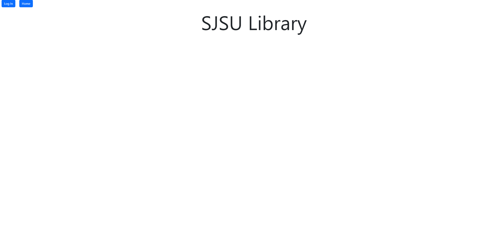
2. 
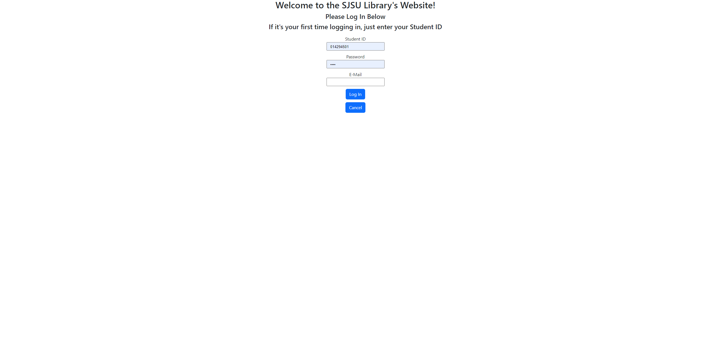
3. 
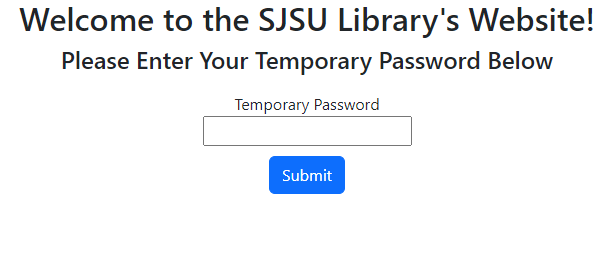 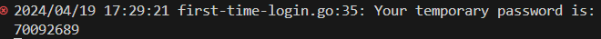
4. 
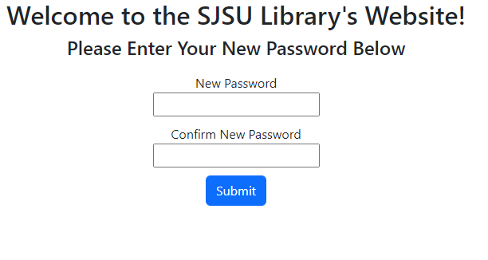
### Signing In
---
1. 
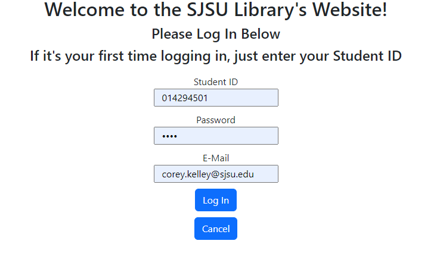
### Checking Out Books
---
1. 
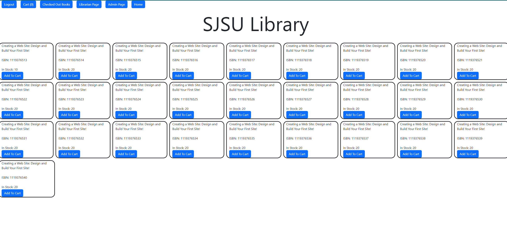
2. 
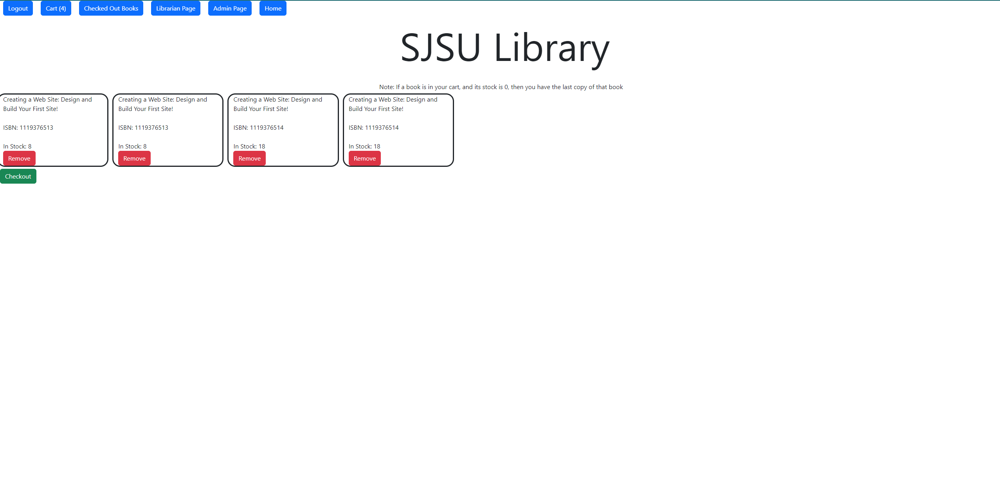

### Viewing Checked Out Books to Reserve For Other Students
---
1. 
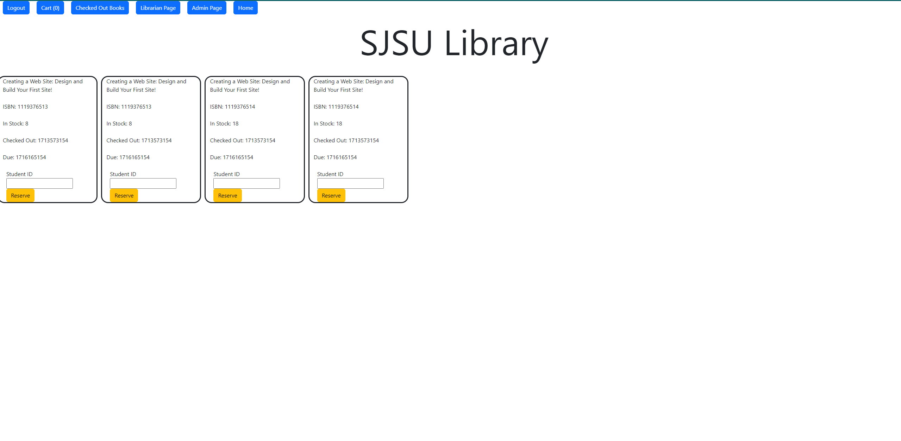
2. 
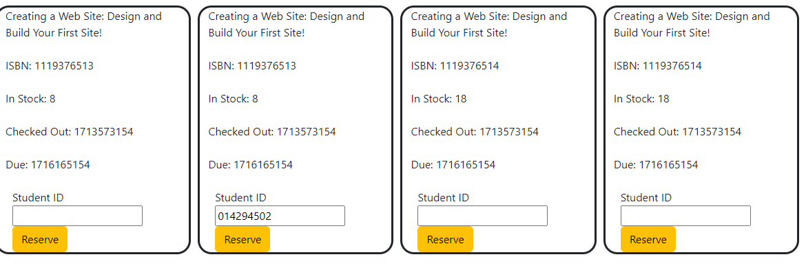

### Adding New Book to Library
---
1. 
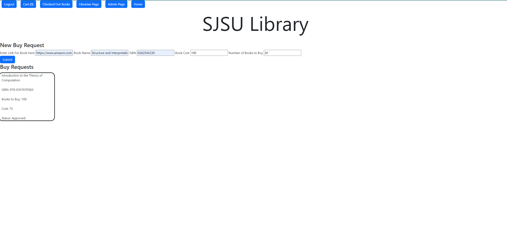

### Admin Page for Editing Roles
---
1. 
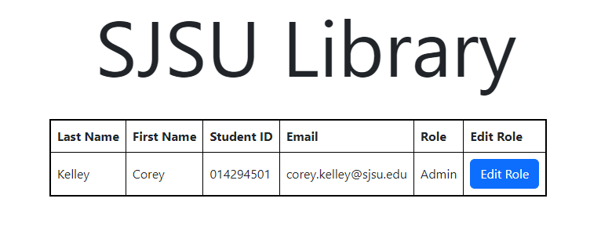
2. 
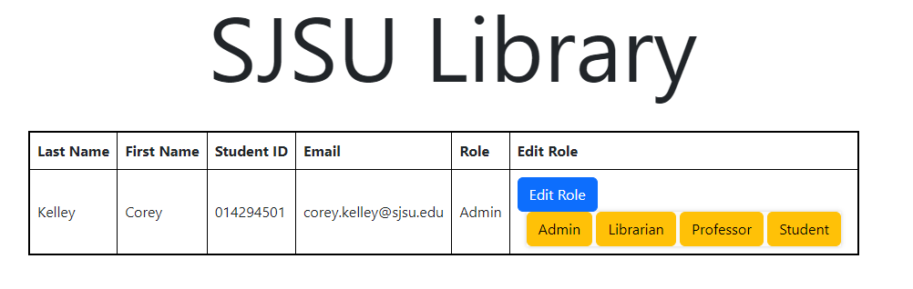